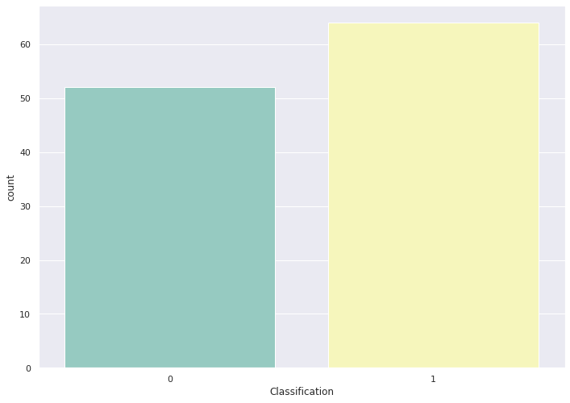
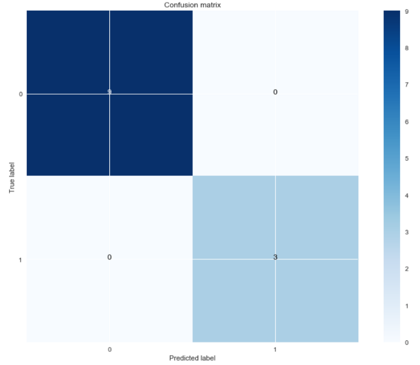

# Decision-Tree-for-Breast-cancer-detection
implemening decision trees algorithm with bagging as a normlizing technic to predict breast cancer from routine blood tests

## DATA
The dataset contains only the following ten attributes:

+Age: age of the patient (years)
+ BMI: body mass index (kg/m²)
+ Glucose: glucose concentration in blood (mg/dL)
+ Insulin: insulin concentration in blood (microU/mL)
+ HOMA: Homeostatic Model Assessment of Insulin Resistance (glucose multiplied by insulin)
+ Leptin: concentration of leptin — the hormone of energy expenditure (ng/mL)
+ Adiponectin: concentration of adiponectin — a protein regulating glucose levels (micro g/mL)
+ Resistin: concentration of resistin — a protein secreted by adipose tissue (ng/mL)
+ MCP.1: concentration of MCP-1 — a protein that recruits monocytes to the sites of inflammation due to tissue injury or inflammation (pg/dL)
+ Classification: Healthy controls (1) or patient (2)

## Data Visualisation

As you can see there are two classes with almost the same number of samples


## Results with bagging
```
from sklearn.ensemble import BaggingClassifier

bagging_clf = BaggingClassifier()

bagging_clf.fit(X_train, y_train.ravel())
y_pred_bag = bagging_clf.predict(X_test)

bag_cm = confusion_matrix(y_test, y_pred_bag)

plot_confusion_matrix(bag_cm, [0, 1])
plt.show()
```



After ploting the confusion matrix we can see our model classified correctly all instances in the test set using bagging normalization.


## License


